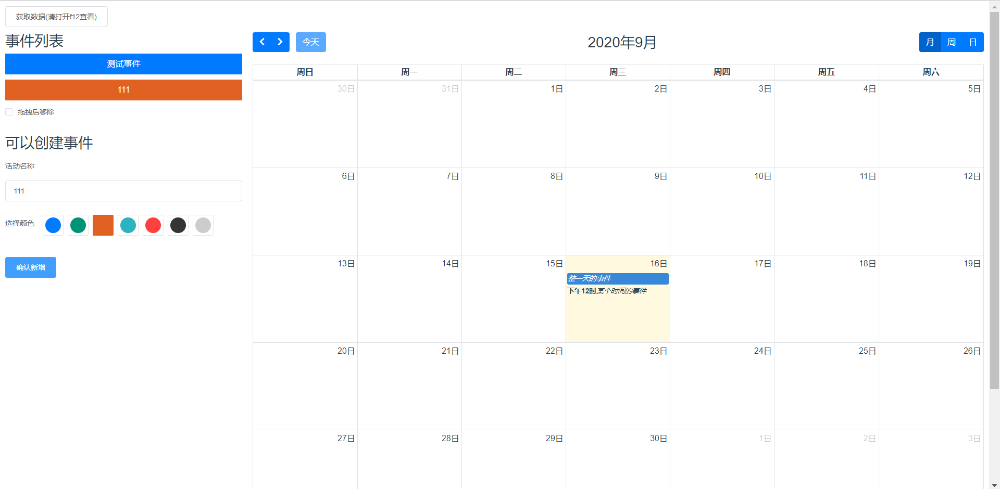

#这是针对fullcalendar v5版本所做的vue demo
###在原有基础上新增了拖拽的样例

### 效果图如下：



## 初始化
```
yarn install
```

### 运行
```
yarn serve
```

### 打包
```
yarn build
```

### 注意
代码仅供参考，部分代码是根据官网的demo进行查看，可以进入官网查看api和查找demo [跳转链接](https://fullcalendar.io/).
